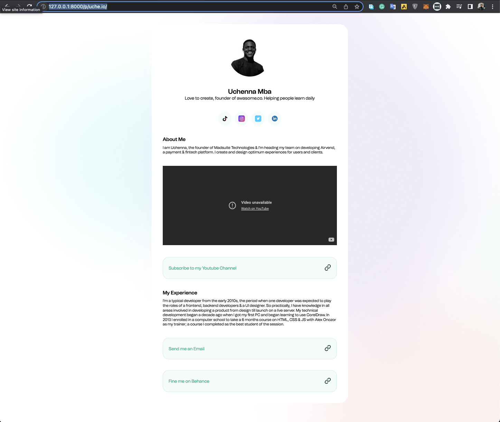
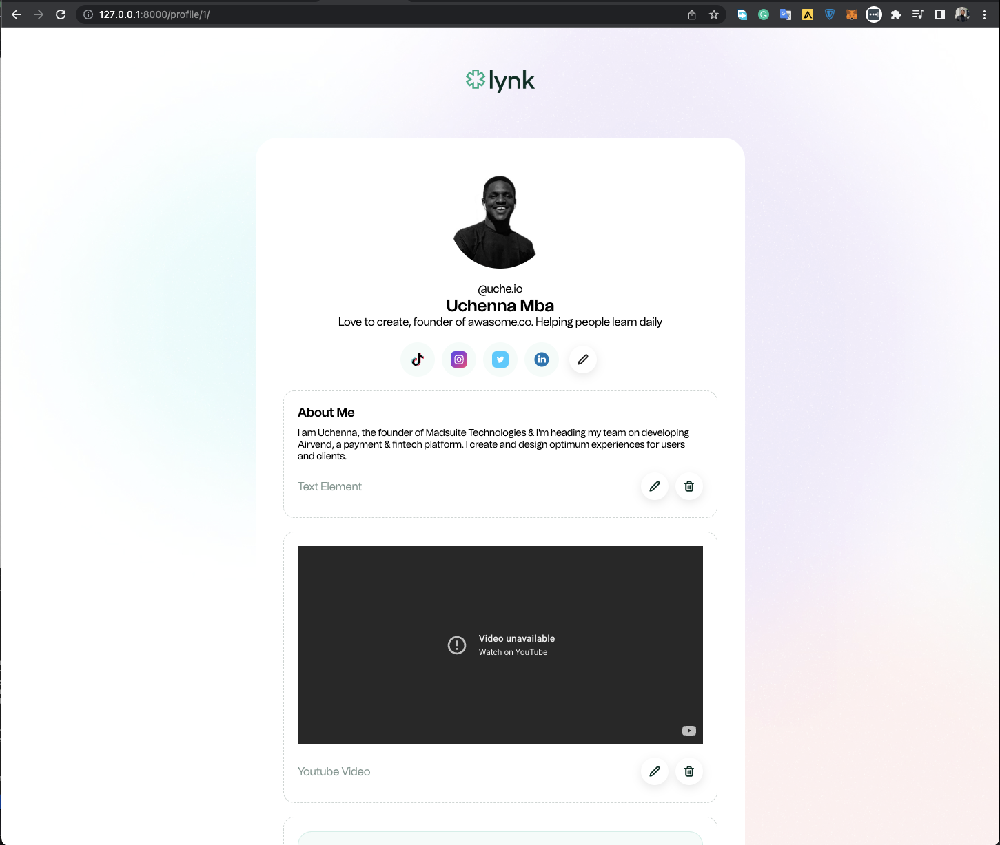
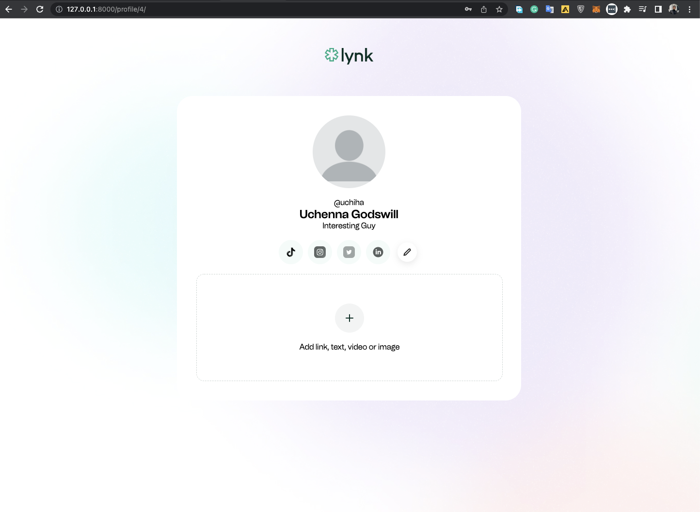
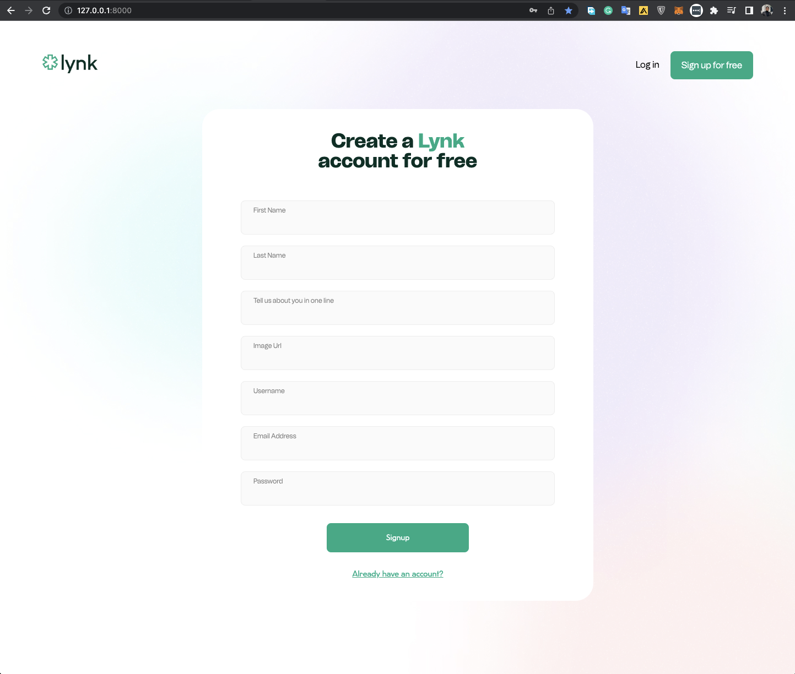

# Lynk - A Social Media Link Aggregator

"BEST TO READ .MD files in a .MD viewer like Typora or View same file but better on [Github](https://github.com/urchymanny/wtaa_app/blob/main/readme.MD)

This project - web app - makes it possible for users to create a quick portfolio page that can quickly describe them and point their readers to all their other social media accounts and website that connect to them all over the internet.

## 

## Stack used in this project

- Html
- Css
- Javascript
- Ajax
- Django
- Python
- SQlite3

## Architecture

To develop this project, I created a django project titled "wtaa_app" and added the `lynk` project as a subfolder in the root directory

I had to create two models `User` and `Elements`

### - Users

As explained in the introduction of this project, this project is for users or members who signed up. This means I had to work on a signup form for the users. The form collects data including

- First Name + Last Name
- Username
- A personal Bio
- Email Address
- Phone Number
- Password
- Social Media Accounts
  - linkedin, tiktok, instagram, twitter

These information are collected, processed and stored on the database table created for `UserModel`

### - Elements

Every user on the web application can create multiple elements that make up their `lynk` page - for this project, I have added three element types

- Text Element
  - Text element allows the user to set a title and write a text body below it
- Web Link Element
  - A user can add any link of their choice and it would appear as a button on their public page
- Youtube Element
  - A user would also be able to attach a youtube video to their page

Though there are three different element types, they all share the same table on the database and belong to the same `Element Class`

## Views

for the views, I think it's better to take a quick look at the urls.py file, which is connected to the view functions in the project. 

``` python
.... views.py

urlpatterns = [
    # loading the app would lead you straight to the signup page
  	# you have an option to login if you're already registered
    path("", views.signup, name="index"),
    path("signup/", views.signup, name="signup"),
    path("login/", views.login, name="login"),
    path("logout/", views.logout, name="logout"),
  
  	# after logging in or signup, you would be redirected to
    # profile page which takes an integer ID, /edit would 
    # load a form to update profile
    path("profile/<int:user_id>/", views.profile, name="profile"),
    path("profile/<int:user_id>/edit", views.edit_profile, name="edit_profile"),

    # create user is the function that handles the signup form
    # update user is the function that handles the user profile update
    path("create_user", views.create_user, name="create_user"),
    path("update_user/<int:user_id>/", views.update_user, name="update_user"),
  
    # public show page takes the user's username
    # finds the user and loads the user's public page 
    path("p/<str:username>/", views.public_show, name="public_show"),
  
    # to create a new element, we pass the user id because the 
    # element belongs to a user and then to update an element
    # we do the same but this time with the element ID as well
    path("profile/<int:user_id>/create_element",
         views.create_element, name="create_element"),
    path("profile/<int:user_id>/elements/new/",
         views.add_element, name="add_element"),
    path("profile/<int:user_id>/elements/edit/<int:element_id>/",
         views.edit_element, name="edit_element"),
    path("profile/<int:user_id>/elements/update/<int:element_id>",
         views.update_element, name="update_element"),
    path("profile/<int:user_id>/elements/delete/<int:element_id>",
         views.delete_element, name="delete_element"),
]

....
```


## Templates

For Templates, I first created a folder in the `lynk` app folder named `templates/lynk`. In this folder, I added 5 subfolders

- `auth/` for all templates connected with authenticating a user like
  - `login.html`
  - `signup.html`
- `elements/` for all components connected to creating and editing elements. I also broke some of the reusable components into smaller html files. including
  - `text-form.html`
  - `web-form.html`
  - `yt-form.html`
- `profile/` contains html files that shows the users profile and a preview of what their page would look like prior to getting a public url that can be shared
- `public/` contains the template for the users page that is visible to the public, what ever is changed on the profile is reflected on the public show page
- `ui` I added the master layouts in this view to seperate them from the other files

## Javascript

Javascript was used to handle some form events in the Element creation process. I was able to show only the form fields that were required on the Add Element page.

When The element type is set to Text, I showed only 

- Text Header
- Text Body

for Web Link:

- URL
- Link Text

and for Youtube, I asked for only the video URL

### Ajax

Ajax was used in deleting an element from the user's profile page, sending a request, and performing another action with the response that came from the server

### CSS

for the CSS code on this application, I broke them down into different files and then imported them into the main.css file.

``` css
.... main.css

@import "navbar.css";
@import "cards.css";
@import "inputs.css";
@import "auth.css";
@import "profile.css";
```

This made it easy to manage the web application design as most components style was grouped into a category

#### ALL PAGES ARE RESPONSIVE


### Screenshots

Screenshots can be found in `screenshots` folder on the root directory of the project

- Editing Your Profile



- First Time Logging in



- Sign Up Page




## Running the Application

To run this application, you need to run the following code from the project directory

```	shell
cd path/to/project
pip install -r requirements.txt
```

This would install the requirements needed to run the project


Then thing to do would be migrating the models to a database on your PC. This must be done from the folder where the manage.py is, in this case, it is in the root folder of the project

``` shell
python manage.py migrate
```

Lastly, Start a server
```shell
python manage.py runserver
```

